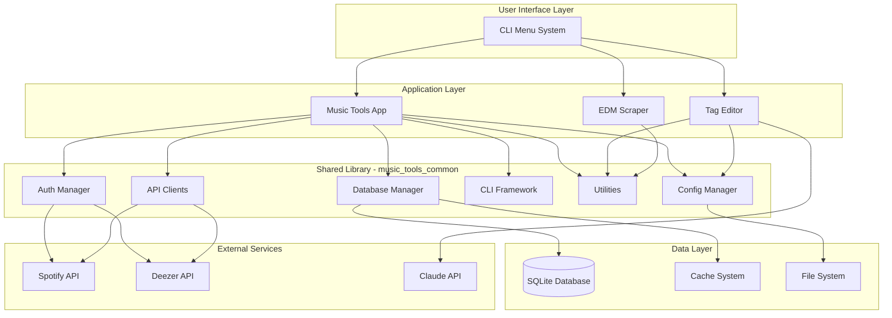
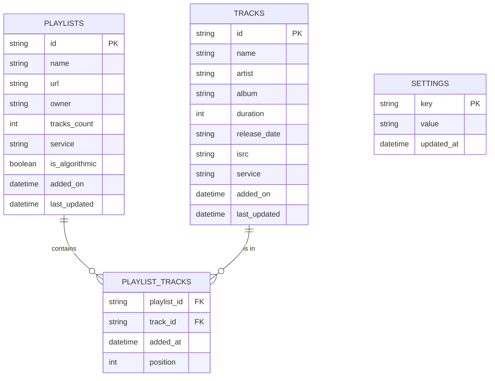
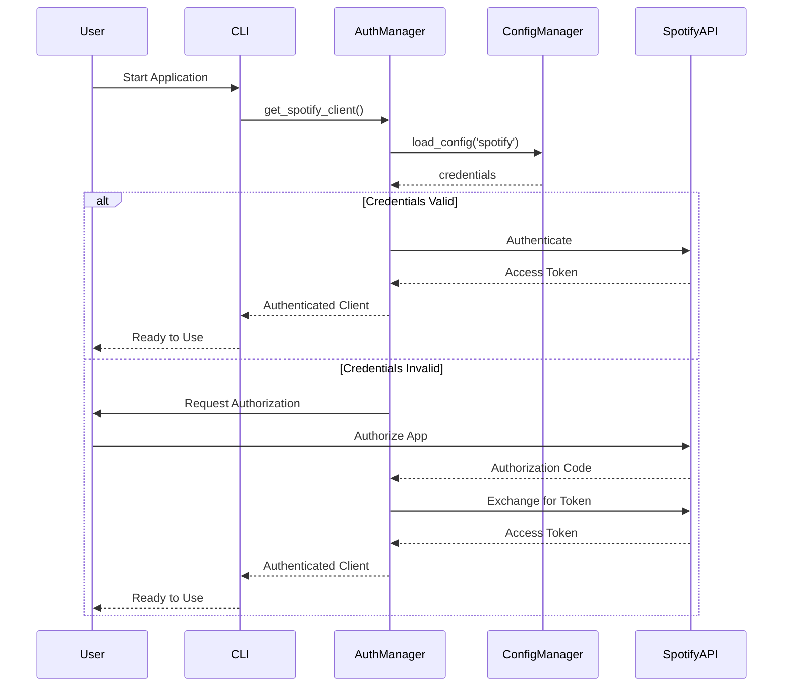
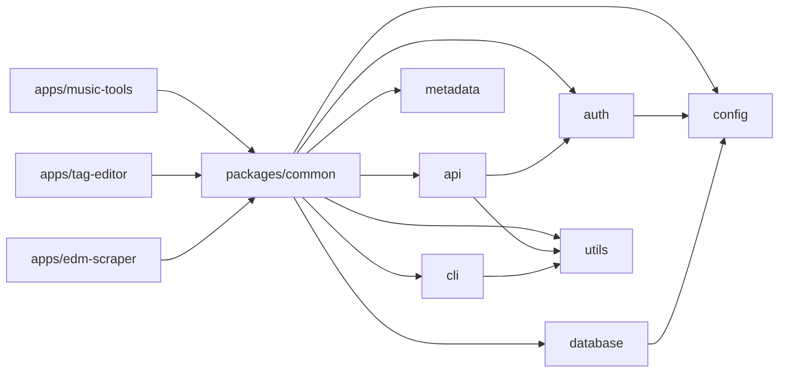

# Documentation Improvement Recommendations
## Music Tools Development Project

**Generated:** 2025-11-19
**Priority Order:** HIGH to LOW
**Total Estimated Effort:** 110 hours over 3 months

---

## Immediate Actions (Week 1) - 18 hours

### 1. Complete Critical Docstrings
**Priority:** HIGH | **Effort:** 8 hours | **Impact:** Immediate improvement in maintainability

**Action Items:**
- [ ] Add docstrings to api/base.py (8 functions)
- [ ] Add docstrings to metadata/reader.py (6 functions)
- [ ] Add docstrings to metadata/writer.py (6 functions)
- [ ] Add docstrings to cli/menu.py (5 functions)

**Template:**
```python
def function_name(param1: Type1, param2: Type2) -> ReturnType:
    """Brief one-line description.

    Detailed explanation of function behavior and purpose.

    Args:
        param1: Description with type info
        param2: Description with default behavior

    Returns:
        Description of return value

    Raises:
        ExceptionType: When this occurs

    Example:
        >>> result = function_name("test", 42)
        >>> print(result)
        expected output
    """
```

**Modules to Update:**
1. `/packages/common/music_tools_common/api/base.py`
2. `/packages/common/music_tools_common/metadata/reader.py`
3. `/packages/common/music_tools_common/metadata/writer.py`
4. `/packages/common/music_tools_common/cli/menu.py`

**Success Criteria:**
- All public methods have docstrings
- Docstring coverage increases from 73% to 85%
- All critical APIs documented

---

### 2. Fix Outdated Path References
**Priority:** HIGH | **Effort:** 2 hours | **Impact:** Fix broken links, reduce confusion

**Action Items:**
- [ ] Update README.md path references
- [ ] Update DOCUMENTATION_INDEX.md references
- [ ] Update architecture document paths
- [ ] Verify all documentation links work

**Files to Update:**
```bash
# Find and replace in these files:
README.md (lines 164, 166, 402)
DOCUMENTATION_INDEX.md
docs/architecture/*.md
```

**Search and Replace:**
| Old Reference | New Reference |
|--------------|---------------|
| `Music Tools/README.md` | `apps/music-tools/README.md` |
| `Tag Country Origin Editor` | `Tag Editor` (or current name) |
| `music_tools_common/README.md` | `packages/common/README.md` |
| `EDM Sharing Site Web Scrapper` | `EDM Scraper` |

**Success Criteria:**
- No broken documentation links
- All paths use current monorepo structure
- Consistent terminology throughout docs

---

### 3. Add Missing Type Hints
**Priority:** MEDIUM | **Effort:** 8 hours | **Impact:** Better IDE support, type safety

**Action Items:**
- [ ] Add type hints to api/base.py
- [ ] Add type hints to metadata/reader.py
- [ ] Add type hints to metadata/writer.py
- [ ] Add type hints to cli/menu.py
- [ ] Run mypy validation
- [ ] Fix any type errors

**Implementation:**
```bash
# Install mypy
pip install mypy

# Check current state
mypy packages/common/music_tools_common

# Add type hints to each file
# Example:
def process_data(data: Dict[str, Any], filter_value: Optional[str] = None) -> List[str]:
    ...

# Validate
mypy packages/common/music_tools_common --strict
```

**Type Hint Standards:**
```python
from typing import Dict, List, Optional, Any, Union, Tuple

# Always annotate:
- Function parameters
- Return types
- Class attributes
- Complex nested types

# Use proper typing:
Dict[str, Any]  # not just dict
List[str]       # not just list
Optional[int]   # for nullable values
Union[str, int] # for multiple types
```

**Success Criteria:**
- Type hint coverage increases from 60% to 90%
- mypy validation passes with minimal errors
- All public APIs have complete type annotations

---

## Short-term Improvements (Month 1) - 38 hours

### 4. Set Up Sphinx Documentation
**Priority:** HIGH | **Effort:** 12 hours | **Impact:** Professional API docs

**Action Items:**
- [ ] Install Sphinx and dependencies
- [ ] Configure Sphinx for the project
- [ ] Set up autodoc for automatic API generation
- [ ] Create documentation structure
- [ ] Generate initial API documentation
- [ ] Configure Read the Docs theme
- [ ] Set up auto-build on commit

**Implementation Steps:**

**Step 1: Installation**
```bash
pip install sphinx sphinx-rtd-theme sphinx-autodoc-typehints
pip install sphinx-autobuild  # For live preview
```

**Step 2: Initialize Sphinx**
```bash
cd docs
mkdir api
cd api
sphinx-quickstart
# Answer prompts:
# - Separate source and build: Yes
# - Project name: Music Tools Common
# - Author name: Your team
# - Project version: 1.0.0
# - Language: en
```

**Step 3: Configure conf.py**
```python
# docs/api/source/conf.py

import os
import sys
sys.path.insert(0, os.path.abspath('../../../packages/common'))

project = 'Music Tools Common'
copyright = '2025, Music Tools Team'
author = 'Music Tools Team'
version = '1.0.0'

extensions = [
    'sphinx.ext.autodoc',
    'sphinx.ext.napoleon',
    'sphinx.ext.viewcode',
    'sphinx.ext.intersphinx',
    'sphinx_autodoc_typehints',
]

templates_path = ['_templates']
exclude_patterns = []

html_theme = 'sphinx_rtd_theme'
html_static_path = ['_static']

# Napoleon settings for Google-style docstrings
napoleon_google_docstring = True
napoleon_numpy_docstring = False
napoleon_include_init_with_doc = True
```

**Step 4: Generate API Docs**
```bash
sphinx-apidoc -f -o source/ ../../../packages/common/music_tools_common
make html
```

**Step 5: Documentation Structure**
```
docs/api/
├── source/
│   ├── conf.py
│   ├── index.rst
│   ├── modules/
│   │   ├── config.rst
│   │   ├── database.rst
│   │   ├── auth.rst
│   │   ├── cli.rst
│   │   ├── utils.rst
│   │   ├── api.rst
│   │   └── metadata.rst
│   ├── examples.rst
│   └── _static/
└── build/
    └── html/
```

**Step 6: Auto-build Setup**
```bash
# Add to .github/workflows/docs.yml
name: Build Documentation

on:
  push:
    branches: [ main ]
  pull_request:
    branches: [ main ]

jobs:
  build-docs:
    runs-on: ubuntu-latest
    steps:
      - uses: actions/checkout@v2
      - name: Set up Python
        uses: actions/setup-python@v2
        with:
          python-version: 3.9
      - name: Install dependencies
        run: |
          pip install -r requirements.txt
          pip install sphinx sphinx-rtd-theme sphinx-autodoc-typehints
      - name: Build documentation
        run: |
          cd docs/api
          make html
      - name: Deploy to GitHub Pages
        uses: peaceiris/actions-gh-pages@v3
        if: github.ref == 'refs/heads/main'
        with:
          github_token: ${{ secrets.GITHUB_TOKEN }}
          publish_dir: ./docs/api/build/html
```

**Success Criteria:**
- Sphinx documentation builds without errors
- All modules have API reference pages
- Documentation is accessible via web browser
- Auto-deployment to GitHub Pages works
- Documentation is linked from main README

---

### 5. Create Comprehensive Examples
**Priority:** MEDIUM | **Effort:** 16 hours | **Impact:** Better developer experience

**Action Items:**
- [ ] Create basic examples directory
- [ ] Write 5 basic examples
- [ ] Write 4 intermediate examples
- [ ] Write 3 advanced examples
- [ ] Test all examples
- [ ] Add examples to documentation

**Directory Structure:**
```
docs/examples/
├── README.md                         # Examples index
├── basic/
│   ├── 01-configuration-setup.md
│   ├── 02-database-crud.md
│   ├── 03-spotify-auth.md
│   ├── 04-deezer-auth.md
│   └── 05-simple-cli-tool.md
├── intermediate/
│   ├── 01-custom-cli-tool.md
│   ├── 02-retry-logic.md
│   ├── 03-batch-processing.md
│   └── 04-cache-optimization.md
└── advanced/
    ├── 01-custom-auth-provider.md
    ├── 02-database-extension.md
    └── 03-performance-tuning.md
```

**Example Template:**
```markdown
# Example Title

## Use Case
Brief description of what this example demonstrates.

## Prerequisites
- Python 3.8+
- music_tools_common installed
- Spotify API credentials (if applicable)

## Code
\`\`\`python
# Full working example with comments
from music_tools_common.config import config_manager

# Step 1: Load configuration
config = config_manager.load_config('spotify')

# Step 2: Do something useful
...
\`\`\`

## Expected Output
\`\`\`
Show what the user should see
\`\`\`

## Common Pitfalls
- Watch out for X
- Remember to Y

## Related
- [Module Documentation](link)
- [Another Example](link)
```

**Examples to Create:**

**Basic (5 examples):**
1. Configuration Setup - Load/save config, environment variables
2. Database CRUD - Add/get/update/delete playlists and tracks
3. Spotify Authentication - Complete OAuth flow
4. Deezer Authentication - Login and session management
5. Simple CLI Tool - Using BaseCLI class

**Intermediate (4 examples):**
1. Custom CLI Tool - Menu system, prompts, progress bars
2. Retry Logic - Using retry decorator for API calls
3. Batch Processing - Process multiple playlists efficiently
4. Cache Optimization - Using cache for performance

**Advanced (3 examples):**
1. Custom Authentication Provider - Extending auth system
2. Database Extension - Adding custom tables/models
3. Performance Tuning - Optimization techniques

**Success Criteria:**
- All 12 examples written and tested
- Examples cover common use cases
- Code runs without errors
- Examples referenced in main docs
- Examples index created

---

### 6. Add Architecture Diagrams
**Priority:** MEDIUM | **Effort:** 6 hours | **Impact:** Visual understanding

**Action Items:**
- [ ] Create system architecture diagram
- [ ] Create database schema diagram
- [ ] Create authentication flow diagram
- [ ] Create module dependency diagram
- [ ] Create API interaction diagram
- [ ] Add diagrams to documentation

**Use Mermaid for GitHub Compatibility:**

**System Architecture Diagram:**


**Database Schema Diagram:**


**Authentication Flow Diagram:**


**Module Dependency Diagram:**


**Files to Create:**
```
docs/architecture/diagrams/
├── README.md (index of all diagrams)
├── system-overview.md
├── database-schema.md
├── auth-flow.md
├── module-dependencies.md
└── api-interactions.md
```

**Success Criteria:**
- All 5 diagrams created and documented
- Diagrams render correctly in GitHub
- Diagrams linked from architecture docs
- Diagrams help explain complex concepts

---

### 7. Add Module READMEs
**Priority:** LOW | **Effort:** 4 hours | **Impact:** Better module navigation

**Action Items:**
- [ ] Create README for database module
- [ ] Create README for auth module
- [ ] Create README for CLI module
- [ ] Create README for API module
- [ ] Create README for metadata module
- [ ] Create README for utils module

**Template:**
```markdown
# [Module Name]

Brief description of module purpose.

## Features
- Feature 1
- Feature 2
- Feature 3

## Quick Start
\`\`\`python
from music_tools_common.[module] import Class

# Basic usage example
obj = Class()
result = obj.method()
\`\`\`

## API Reference
- [Class1](link to docs)
- [Class2](link to docs)
- [function1](link to docs)

## Examples
- [Basic Example](link)
- [Advanced Example](link)

## Related
- [Another Module](link)
- [User Guide](link)
```

---

## Long-term Enhancements (Months 2-3) - 54 hours

### 8. Implement Documentation Testing
**Priority:** MEDIUM | **Effort:** 8 hours

**Action Items:**
- [ ] Set up doctest
- [ ] Set up link checker
- [ ] Add tests to CI/CD
- [ ] Fix failing tests

**Implementation:**
```python
# Add to pytest
def test_docstrings():
    import doctest
    import music_tools_common.config.manager
    results = doctest.testmod(music_tools_common.config.manager)
    assert results.failed == 0

# Link checker
npm install -g markdown-link-check
# Add to CI/CD
```

---

### 9. Create Interactive Tutorials
**Priority:** LOW | **Effort:** 20 hours

**Action Items:**
- [ ] Create Jupyter notebook tutorials
- [ ] Create interactive demos
- [ ] Test all tutorials
- [ ] Publish tutorials

**Notebooks:**
```
docs/tutorials/
├── 01-getting-started.ipynb
├── 02-spotify-integration.ipynb
├── 03-database-operations.ipynb
└── 04-building-your-first-tool.ipynb
```

---

### 10. Video Documentation
**Priority:** LOW | **Effort:** 30 hours

**Videos:**
- Project overview (5 min)
- Quick start (10 min)
- Building a tool (15 min)
- Advanced features (20 min)

---

## Maintenance Schedule

### Weekly Tasks
- [ ] Check for broken links
- [ ] Review new code for documentation
- [ ] Update examples if API changes

### Monthly Tasks
- [ ] Review and update all examples
- [ ] Check documentation freshness
- [ ] Update version references
- [ ] Review and respond to documentation issues

### Quarterly Tasks
- [ ] Comprehensive documentation audit
- [ ] Update all diagrams
- [ ] Review and archive old documents
- [ ] Update video tutorials

---

## Success Metrics

### Target Metrics (3 Months)
- Docstring coverage: 90%+ (currently 73%)
- Type hint coverage: 100% (currently 60%)
- API documentation: Complete Sphinx site
- Code examples: 15 comprehensive examples (currently 4)
- Broken links: 0
- Documentation freshness: < 30 days old

### Progress Tracking
```
Week 1:  [    ] 0%    Complete immediate actions
Week 2-4: [    ] 25%   Set up Sphinx
Week 5-8: [    ] 50%   Create examples
Week 9-12: [    ] 75%   Add diagrams, testing
Week 13+: [    ] 100%  Tutorials, maintenance
```

---

## Resources Required

**Tools:**
- Sphinx and extensions
- Markdown link checker
- Mermaid diagram support
- Jupyter notebooks
- Video recording software

**Time Investment:**
- Immediate: 18 hours
- Short-term: 38 hours
- Long-term: 54 hours
- **Total: 110 hours**

**Ongoing:**
- 4-6 hours per month for maintenance

---

**Generated:** 2025-11-19
**Next Review:** 2025-12-19
**Version:** 1.0
